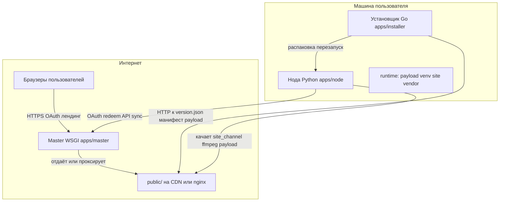

# nodeadline.online — устройство проекта

Документ описывает **что это за система**, **из каких частей она состоит**, **как сейчас устроены обновления и конфигурация**, и куда смотреть для деталей. Он не заменяет пошаговые инструкции в [README.md](../README.md) и [deploy/DEPLOY.md](../deploy/DEPLOY.md).

---

## 1. Зачем этот проект

**Nodeadline** — это платформа, в центре которой **локальная нода** на машине пользователя: дашборд, шары, медиа-пайплайны, сеть (порты, UPnP и т.д.). Пользователь ставит ноду через **установщик** (Go); код ноды поставляется как **Python payload** с сайта.

**Публичный сайт и мастер** (`nodeadline.online`) нужны, чтобы:

- выдавать **OAuth (Google)** и сессии, связывать аккаунт с нодой;
- раздавать **статические артефакты** (`public/`: установщики, payload, каналы обновлений);
- работать **BitTorrent-трекером** и инфраструктурой обновлений (торрент + web seed для больших бандлов);
- при необходимости вызывать **DNS API** (Namecheap) для поддоменов и привязки записей.

То есть **«зачем»**: дать пользователю управляемую ноду у себя на ПК/сервере с единым входом через Google и централизованной поставкой версий, не превращая при этом весь продукт в чисто облачный сервис.

---

## 2. Архитектура на уровне компонентов

| Компонент | Роль | Код |
|-----------|------|-----|
| **Master** | WSGI-приложение (waitress): лендинг, OAuth, трекер, TCP probe, API DNS и др. | [`apps/master/`](../apps/master/main.py) |
| **Node** | Локальный HTTP-сервис: дашборд `/`, API, `/site/` после синка, шары, задачи | [`apps/node/`](../apps/node/main.py), [`libs/`](../libs/) |
| **Installer** | Скачивает `version.json`, манифест, payload; venv; супервизия процесса ноды | [`apps/installer/`](../apps/installer/) |
| **`public/`** | Статика продакшена: `version.json`, `downloads/`, каналы `site_channel.json`, `ffmpeg_channel.json`, зеркало wheels и т.д. | Корень репозитория [`public/`](../public/) |

Конфиги: примеры [`master.example.json`](../master.example.json), [`nodeadline.example.json`](../nodeadline.example.json); реальные секреты не в git.

---

## 3. Как устроены обновления (важно различать)

Сайт в браузере и нода на ПК обновляются **разными путями**.

| Что обновляется | Механизм | Триггер на мастере |
|-----------------|----------|---------------------|
| **Python-код ноды** (`apps/`, `libs/` …) | Архив `core-node-payload.tar.gz`, манифест, SHA256; установщик сравнивает хеш и перезапускает ноду | [`tools/release_payload.sh`](../tools/release_payload.sh), версия в [`public/version.json`](../public/version.json) |
| **Статический UI `/site/`** на ноде | Канал [`site_channel.json`](../public/site_channel.json): `revision`, `bundle_url`, торрент/web seed, проверка SHA256 бандла | [`tools/build_site_channel.py`](../tools/build_site_channel.py) |
| **Бинарники ffmpeg/ffprobe** для ноды (Windows/Linux) | Отдельный канал [`ffmpeg_channel.json`](../public/ffmpeg_channel.json), не путать с версией приложения | [`tools/build_ffmpeg_channel.py`](../tools/build_ffmpeg_channel.py), см. [`vendor/ffmpeg/README.md`](../vendor/ffmpeg/README.md) |
| **Главная страница домена** `https://nodeadline.online/` | Генерируется **master** из кода (например [`download_page.py`](../apps/master/download_page.py)), не из «просто файла» в `public/` | Деплой кода master + перезапуск процесса |

Итог: **«версия» в `version.json`** и **`revision` в `site_channel.json`** — разные оси; **prod сам по себе не обновляется** от локального git commit: нужна сборка и выкладка `public/` (и при необходимости обновление кода master на сервере). Подробно: [deploy/DEPLOY.md](../deploy/DEPLOY.md).

---

## 4. Основные каталоги репозитория

| Путь | Назначение |
|------|------------|
| `apps/master/` | Точка входа мастера, WSGI, лендинг, OAuth, трекер |
| `apps/node/` | Точка входа ноды, маршруты, статика внутри payload |
| `apps/installer/` | Исходники Go-установщика |
| `libs/auth/` | Конфиг, сессии, OAuth, DNS claim, directory, порты |
| `libs/site_sync/` | Синх `/site/` и ffmpeg-канала с мастера (торренты, HTTPS) |
| `libs/torrent/` | Трекер и вспомогательная логика |
| `libs/shares/`, `libs/tasks/`, `libs/media/` | Шары, очередь задач, постеры/медиа |
| `libs/system/` | Очистка процессов, диски, пути к ffmpeg |
| `public/` | То, что в проде отдаётся как статика (после сборок) |
| `tools/` | Скрипты сборки payload, сайта, деплоя, проверок |
| `deploy/` | Примеры nginx, systemd, заметки по деплою |
| `vendor/ffmpeg/` | Исходники для упаковки бинарников в канал ffmpeg |
| `namecheap/`, `scripts/` | Наследие раннего репозитория; актуальный DNS-клиент — `libs/dns/namecheap_api.py` |

---

## 5. Безопасность и границы доверия

Краткая модель угроз и допущения: [**docs/THREAT_MODEL.md**](THREAT_MODEL.md) (публичный интернет ↔ master, браузер ↔ нода, нода ↔ master, планы по шарингу).

---

## 6. Деплой и операции

Единый источник операционных сценариев: [**deploy/DEPLOY.md**](../deploy/DEPLOY.md) и кратко [README.md](../README.md) (ship, release, push `public/`).

---

## 7. Что планируется дальше

В репозитории **нет отдельного официального roadmap-файла** с датами; развитие фиксируется в задачах/обсуждениях команды. Ниже — **типичные направления**, которые уже всплывают в коде или документах (не как обещание сроков):

| Направление | Где зацепка |
|-------------|-------------|
| Усиление модели для публичных шаров (slug/token) | [THREAT_MODEL.md](THREAT_MODEL.md) |
| DNS Namecheap: безопасное слияние записей вместо «одна A-запись на всю зону» | [README.md](../README.md), [DEPLOY.md](../deploy/DEPLOY.md) |
| Целостность контента из BitTorrent до уровня «доверенный снапшот-хеш» | [THREAT_MODEL.md](THREAT_MODEL.md) (`phase 3`) |
| Удобство разработки: несколько источников синка (staging + prod), параметризация URL в `build_site_channel` / смежные темы | обсуждается при необходимости; в коде по умолчанию один `master_base_url` для синка |

При появлении формализованного roadmap его имеет смысл добавить сюда ссылкой или перенести содержание в этот раздел.

---

## 8. Связанные документы

| Документ | Содержание |
|----------|------------|
| [README.md](../README.md) | Быстрый старт, конфиг, релиз payload |
| [deploy/DEPLOY.md](../deploy/DEPLOY.md) | Деплой сайта, ноды vs лендинг, проверки |
| [docs/THREAT_MODEL.md](THREAT_MODEL.md) | Угрозы и границы доверия |
| [vendor/ffmpeg/README.md](../vendor/ffmpeg/README.md) | Зачем ffmpeg-канал и как собрать |
| [public/site/UI_TOOLTIPS.md](../public/site/UI_TOOLTIPS.md) | Подсказки UI дашборда |

---

*Последнее обновление структуры документа: по состоянию репозитория V2.*
